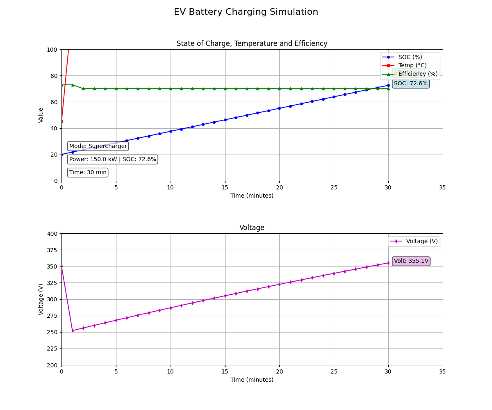

   # 🔋 Smart EV Battery Life Simulator  
**Modeling and Simulation of Electric Vehicle Battery Performance**  

[](https://python.org)
[](LICENSE)

  
*Real-time simulation of EV battery charging dynamics*

## 🌟 Key Features

### 🔬 Realistic Battery Physics
- State of Charge (SOC) calculation
- Temperature-dependent efficiency
- Internal resistance modeling
- Voltage curve simulation
- Thermal management system

### ⚡ Multiple Charging Modes
- **Level 1 Home Charging** (1.8 kW)
- **Level 2 Home Charging** (7.2 kW)
- **Supercharger** (150 kW)

### 📊 Real-Time Visualization
- Live updating graphs:
  - SOC, temperature, efficiency
  - Voltage and power monitoring
- Animated progress (1 sec = 1 min charging)

### 🖱️ Interactive GUI
- Adjustable initial SOC (0-100%)
- Ambient temperature control (-10°C to 45°C)
- Charging mode selection

### ⚙️ Advanced Battery Behavior
- Efficiency decreases as SOC approaches 100%
- Temperature affects charging performance
- Cooling system simulation
- Non-linear voltage curve

## 🧰 Core Libraries
- `NumPy` - Numerical computations
- `Matplotlib` - Visualizations and plots
- `Matplotlib Widgets` - Interactive GUI elements
- `Matplotlib Animation` - Real-time updating graphs

## 🚀 Getting Started

### Prerequisites
- Python 3.10+
- Required packages:  
  ```bash
  pip install numpy matplotlib pillow
